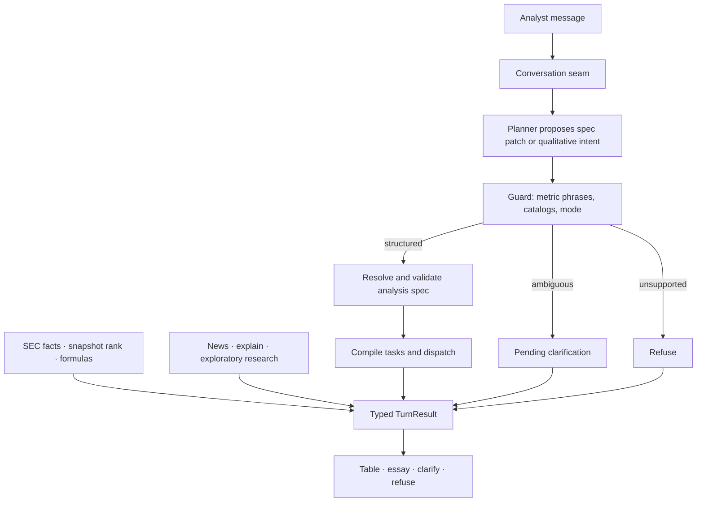

# Financial analyst agent

[](https://github.com/bpyman/financial-analyst-agent/actions/workflows/ci.yml)
[](https://www.python.org/downloads/)
[](https://streamlit.io)

**An evidence-first financial research agent that answers from SEC filings without letting the model touch the numbers.**

A language model interprets the question. Deterministic code owns quarterly facts, identity, arithmetic, ranking membership, and the rendered values.

## Why this is different

1. **SEC quarterly facts** — standalone 10-Q amounts from companyfacts XBRL, with accession, period, concept, and an EDGAR filing link.
2. **Constrained planning** — the model proposes a typed analysis-spec patch; code resolves CIKs, catalog metrics, and period windows. It does not chain tools or invent constituents.
3. **Answers the model cannot rewrite** — tables render from tool output. Essays pass a numeral lock. Ambiguous metrics clarify; unknown scope refuses.

## Try it

Hosted demo (guided fixture data, no keys): [financial-analyst-agent.streamlit.app](https://financial-analyst-agent.streamlit.app). Deploy notes: [`docs/deploy.md`](docs/deploy.md).

Zero-key local path:

```text
uv sync
```

Windows:

```text
copy .env.example .env
```

macOS / Linux:

```text
cp .env.example .env
```

Set `APP_MODE=fixture` in `.env`, then:

```text
uv run python -m streamlit run src/financial_analyst_agent/app.py
```

Fixture mode uses recorded adapters and the same renderer as live. It proves orchestration, not EDGAR freshness.

Example questions:

1. What was Microsoft's latest quarterly pretax income?
2. Compare Tesla and GM revenue
3. What are the top 10 tech companies and R&D spend for each?
4. add Apple
5. make that the last four quarters

## Architecture

One Streamlit window. A persisted **conversation thread** carries a patchable **analysis spec**. Follow-ups edit companies, metrics, periods, and operations instead of restarting. `run_turn` remains a compatibility wrapper over a one-message thread so the gold suite stays green.



Full design: [`docs/design.md`](docs/design.md). ADRs: [`docs/adr/`](docs/adr/).

## Evaluation

The offline suite (including gold rehearsal prompts) is the default CI gate. A generated scorecard with pass rate, latency, and live cost lands with the evaluation ticket; until then, run:

```text
uv run python -m pytest -q
uv run python -m pytest -m gold
```

Live network tests need keys:

```text
uv run python -m pytest tests/integration/test_live_openai_planner.py -m network
uv run python -m pytest tests/integration/test_live_sec_lookup.py -m network
uv run python -m pytest tests/integration/test_live_tavily_news.py -m network
```

The checked-in [evaluation scorecard](docs/evaluation/scorecard.md) reports **8/8** fixture cases passing, p50/p95 latency, and $0 live cost for the recorded path. Regenerate with:

```text
uv run python -m financial_analyst_agent.evaluation
```

Rebuild the ranking freeze (not during a demo turn):

```text
uv run build-universe-snapshot
```

MCP tools (same contracts as in-process) can be served locally:

```text
uv run python -m financial_analyst_agent.mcp_server
```

## Limitations

- Ranking membership is a dated US operating-company snapshot, not a live screener.
- Quarterly facts are directly reported standalone quarters; YTD subtraction is forbidden.
- The metric catalog is closed. Unknown or ambiguous phrases do not guess.
- Public live SEC, if enabled, is quota-guarded. Unrestricted OpenAI/Tavily spend is not exposed to visitors.

## Author

[Blake Pyman](https://github.com/bpyman) — portfolio project.

## Origin

This repo began as a 20 August 2026 interview POC. That session is over; the product continues here. Historical interview notes live under [`docs/archive/interview/`](docs/archive/interview/).
