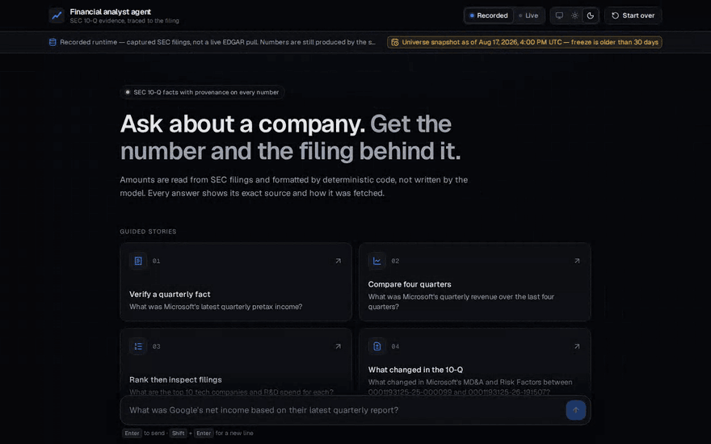
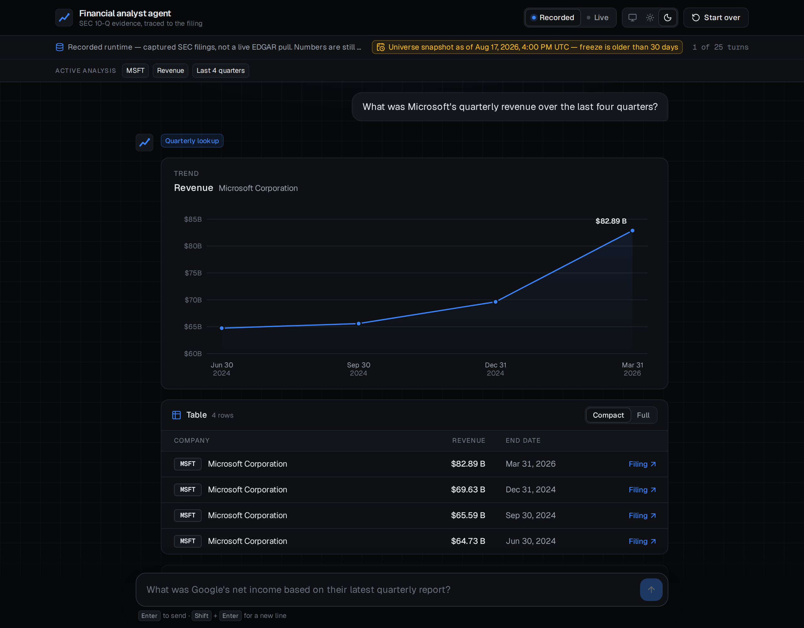
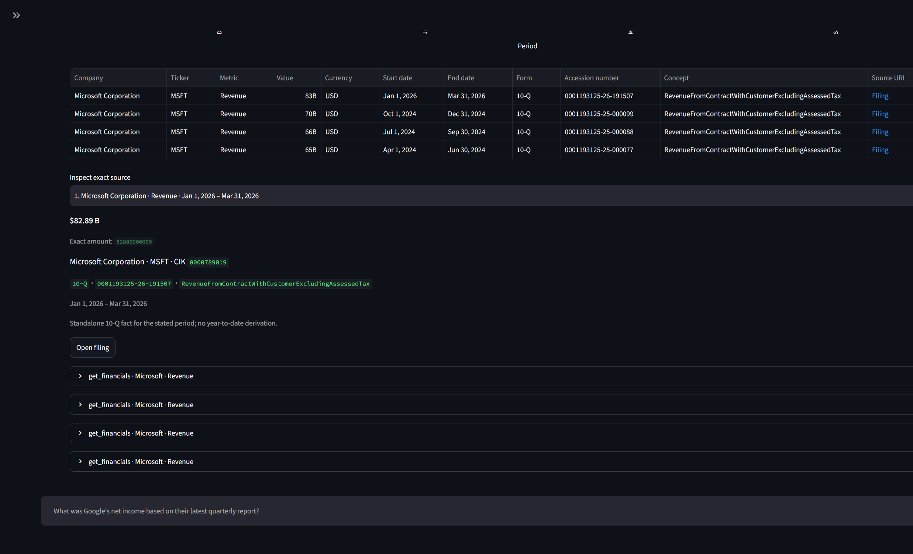
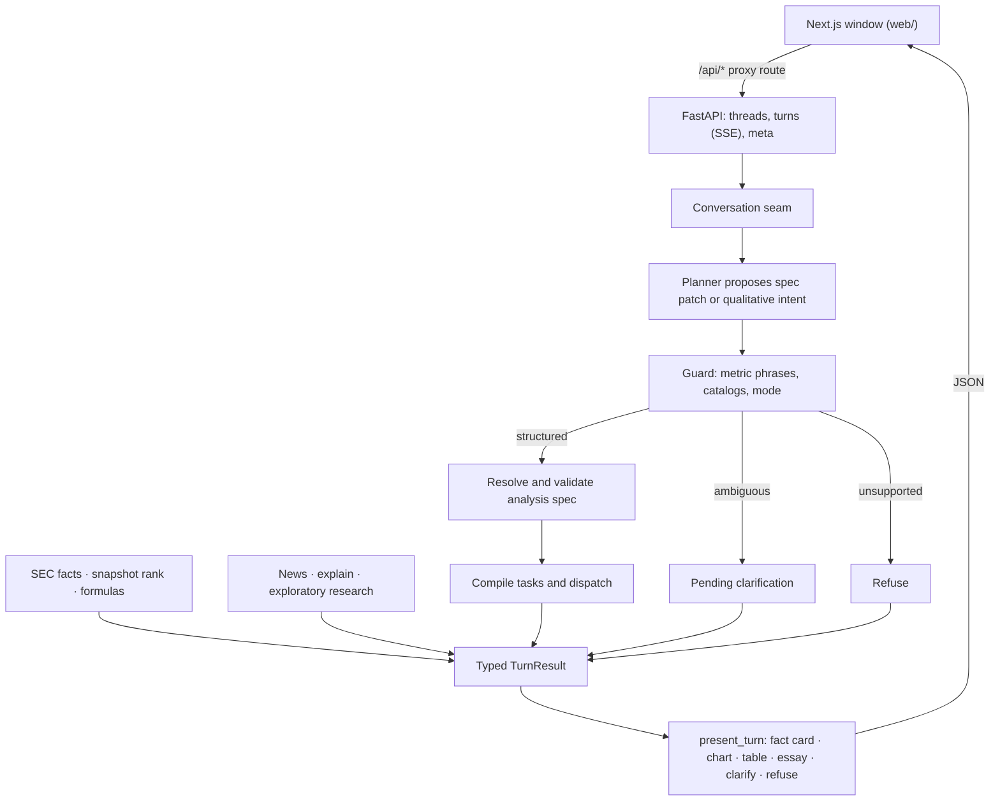

# Financial analyst agent

[](https://github.com/bpyman/financial-analyst-agent/actions/workflows/ci.yml)
[](https://www.python.org/downloads/)
[](web/README.md)
[](https://financial-analyst-agent-ten.vercel.app)

**An evidence-first financial research agent that answers from SEC filings without letting the model touch the numbers.**

A language model interprets the question. Deterministic code owns quarterly facts, identity, arithmetic, ranking membership, and the rendered values.

## Why this is different

1. **SEC quarterly facts** — standalone 10-Q amounts from companyfacts XBRL, with accession, period, concept, and an EDGAR filing link.
2. **Constrained planning** — the model proposes a typed analysis-spec patch; code resolves CIKs, catalog metrics, and period windows. It does not chain tools or invent constituents.
3. **Answers the model cannot rewrite** — tables render from tool output. Essays pass a numeral lock. Ambiguous metrics clarify; unknown scope refuses.

## Try it

Hosted demo (recorded runtime, no keys): [financial-analyst-agent-ten.vercel.app](https://financial-analyst-agent-ten.vercel.app). The API sleeps when idle, so the first question after a quiet spell can take about a minute. Or [run it locally](#run-it-locally) in two commands.



[Walkthrough video](docs/portfolio/images/demo-walkthrough.mp4) — one-click four-quarter compare, `add Apple`, the two-company chart, then the exact 10-Q source behind an Apple value.





The images are captured from the window by a Playwright script against the recorded runtime, so they can be regenerated whenever the window changes (see [Portfolio images](#portfolio-images)).

## Run it locally

The window is a Next.js app (`web/`) that proxies `/api/*` to a Python API ([ADR 0006](docs/adr/0006-react-audience-window.md)). You need [uv](https://docs.astral.sh/uv/) and Node 22 (`.nvmrc`). One-time setup:

```text
uv sync
npm --prefix web install
cp .env.example .env        # Windows: copy .env.example .env
```

`.env.example` sets `APP_MODE=recorded` (`fixture` still works as a deprecated alias), so no keys are needed. Then run the API and the window, each in its own terminal:

```text
uv run serve-api            # the API on http://127.0.0.1:8000
npm --prefix web run dev    # the window on http://localhost:3000
```

Open http://localhost:3000 and click a guided story. [`web/README.md`](web/README.md) lists the window's environment variables, checks, and the browser check.

Beyond the guided stories, try these. Follow-ups such as `add Apple` patch the analysis instead of starting over.

1. What was Microsoft's latest quarterly pretax income?
2. Compare Tesla and GM revenue
3. What are the top 10 tech companies and R&D spend for each?
4. add Apple
5. make that the last four quarters

The recorded runtime replays captured SEC, news, and model responses through the same orchestration and renderer as the live runtime. It proves orchestration, not EDGAR freshness. `APP_MODE=live` with the keys in `.env` runs the live runtime.

## Deploy

The API also ships as a Docker image. It installs from `uv.lock`, runs as a non-root user, listens on `$PORT` (default 8000) on all interfaces, starts on the recorded runtime unless `APP_MODE=live` is set, and has a health check on `/api/health`. The image holds only the installed package: no tests, `web/`, or dev tooling.

```text
docker build -t financial-analyst-api .
docker run --rm -p 8000:8000 financial-analyst-api

# what CI runs: health check, a recorded thread, and the "Verify a quarterly fact" turn
python3 scripts/smoke_api_image.py --image financial-analyst-api
```

The same script checks an API that is already running: `--base-url https://<host>`, plus `--proxy-token` when `API_PROXY_TOKEN` is set.

The hosted setup is the Next.js window on Vercel (`web/vercel.json`) and this image on Render (`render.yaml`). Render deploys a commit only after CI passes. [`docs/deploy.md`](docs/deploy.md) lists every environment variable for each service and where it is set. To go live, run `scripts/deploy_wizard.sh`. It walks through the account steps and checks each one.

## Architecture

The audience window is a Next.js app. The browser only calls the window's own `/api/*`; a route handler proxies each call to a small FastAPI service (`financial_analyst_agent.api`), so the Python origin is never a second public entry point. The API adds no financial logic: it is a transport over the conversation seam, the thread store, and `present_turn`, which turns a result into display records. Every amount shown as text is formatted in Python, and a turn streams progress over server-sent events. See [ADR 0006](docs/adr/0006-react-audience-window.md).

Behind the seam, a persisted **conversation thread** carries a patchable **analysis spec**. Follow-ups edit companies, metrics, periods, and operations instead of restarting. `run_turn` remains a compatibility wrapper over a one-message thread so the gold suite stays green.



Full design: [`docs/design.md`](docs/design.md). ADRs: [`docs/adr/`](docs/adr/).

## Evaluation

The offline suite (including gold rehearsal prompts) is the default CI gate:

```text
uv run python -m pytest -q
uv run python -m pytest -m gold
```

Live network tests need keys:

```text
uv run python -m pytest tests/integration/test_live_openai_planner.py -m network
uv run python -m pytest tests/integration/test_live_sec_lookup.py -m network
uv run python -m pytest tests/integration/test_live_tavily_news.py -m network
```

The checked-in [evaluation scorecard](docs/evaluation/scorecard.md) reports **9/9** recorded-runtime cases passing, p50/p95 latency, and live cost **not measured** on the recorded path. Regenerate with:

```text
uv run python -m financial_analyst_agent.evaluation
```

Rebuild the ranking freeze (not during a demo turn):

```text
uv run build-universe-snapshot
```

MCP tools (same contracts as in-process) can be served locally:

```text
uv run python -m financial_analyst_agent.mcp_server
```

## Portfolio images

`web/scripts/capture-portfolio.ts` drives the window the way the walkthrough shows it, compare four quarters, then `add Apple`, then inspect the exact 10-Q source, and rewrites every image in [`docs/portfolio/images/`](docs/portfolio/images/): the stills at 2x, the 1280×640 social preview (the landing headline beside the window's fact card, composed by `web/scripts/social-card.ts`), and the walkthrough as MP4 and GIF. It uses the recorded runtime and the default dark theme, and needs ffmpeg on `PATH` or in `$FFMPEG`.

```text
cd web
npm run build
npm run capture
```

It starts the recorded API and the built window itself, as the browser check does, or reuses them if they are already running.

## Limitations

- Ranking membership is a dated US operating-company snapshot, not a live screener.
- Quarterly facts are directly reported standalone quarters; YTD subtraction is forbidden.
- The metric catalog is closed. Unknown or ambiguous phrases do not guess.
- Public live SEC, if enabled, is quota-guarded. Unrestricted OpenAI/Tavily spend is not exposed to visitors.

## Author

[Blake Pyman](https://github.com/bpyman) — portfolio project.

## Origin

This repo began as a 20 August 2026 interview POC. That session is over; the product continues here. Historical interview notes live under [`docs/archive/interview/`](docs/archive/interview/).
