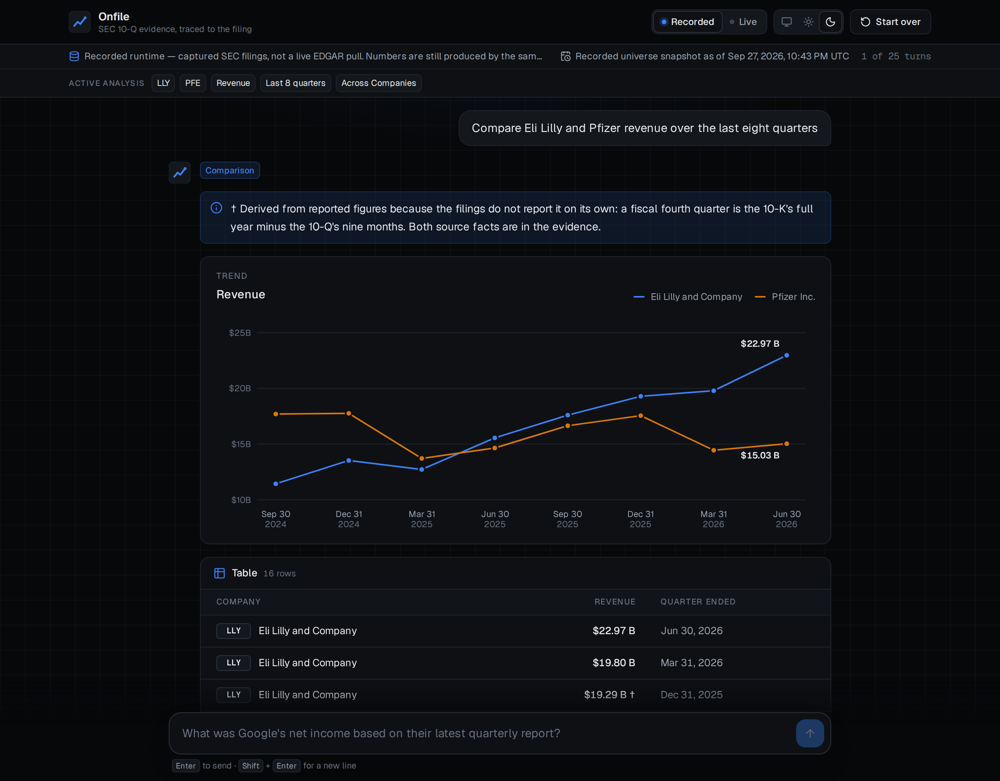
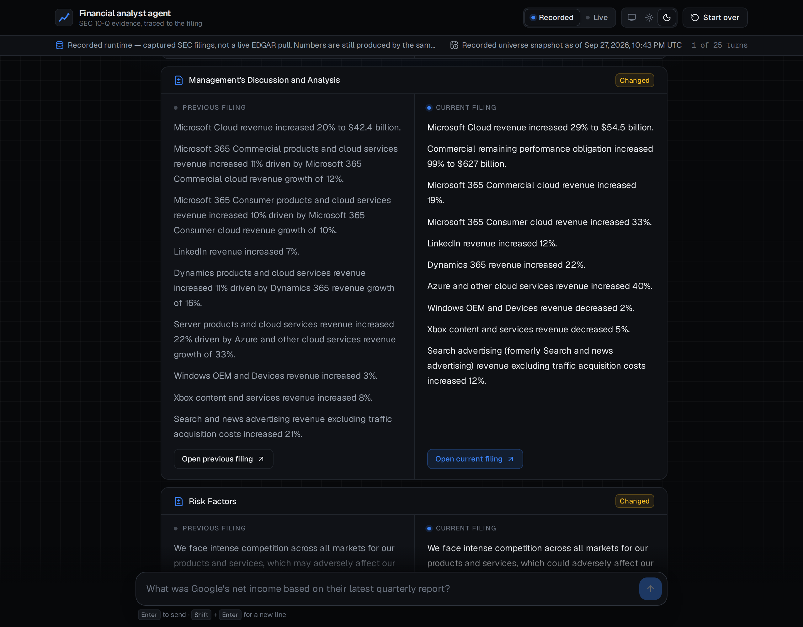
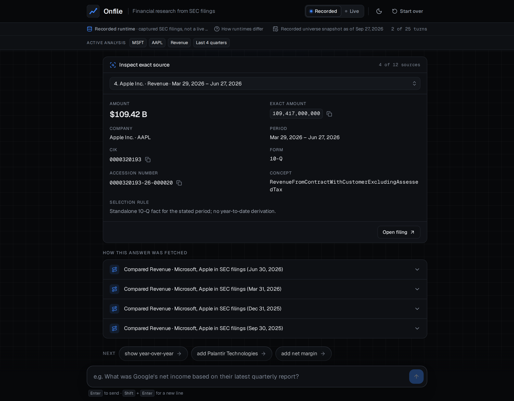
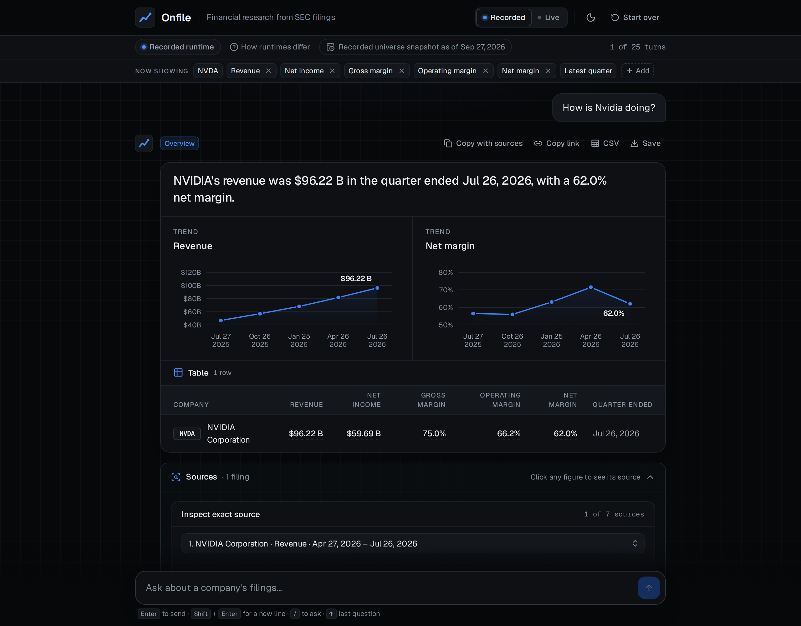
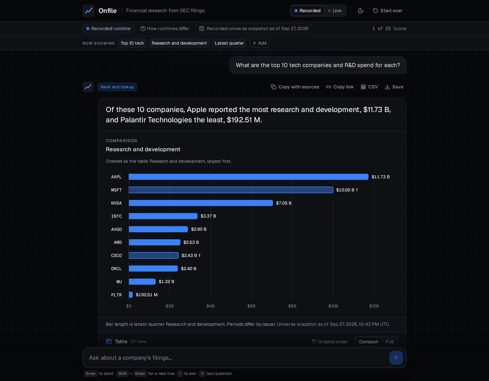
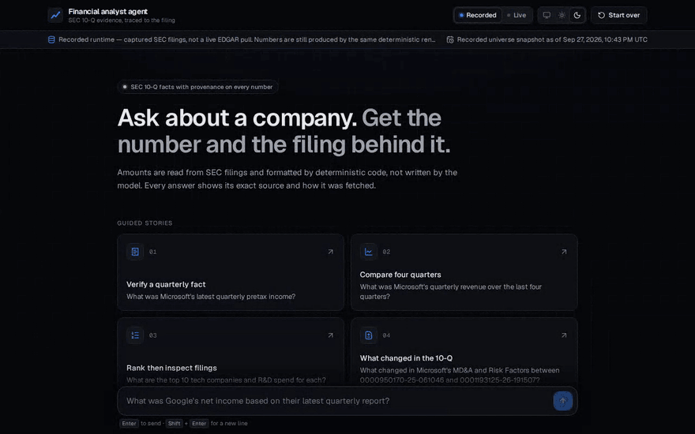
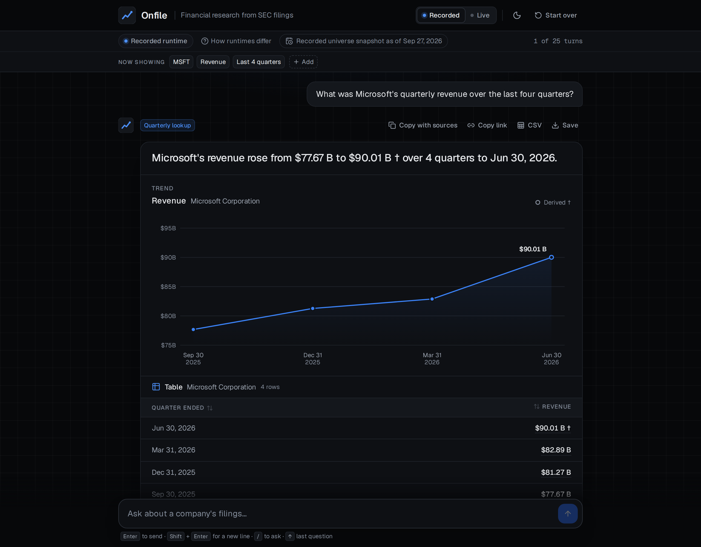
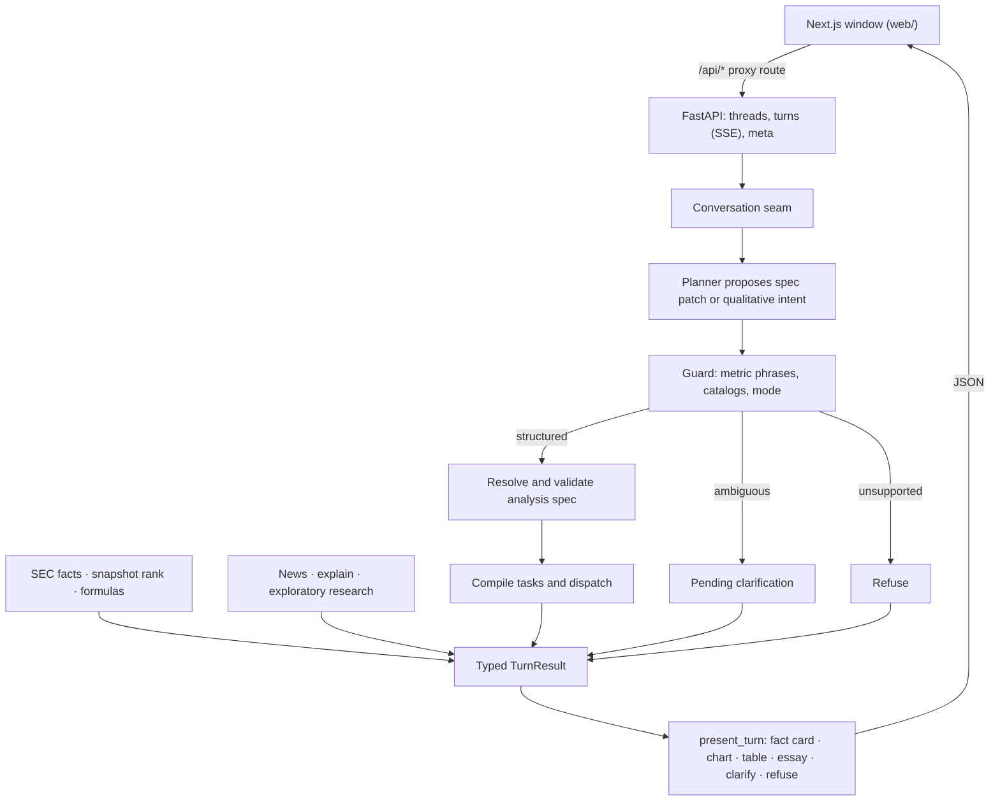

# Onfile

[](https://github.com/bpyman/onfile/actions/workflows/ci.yml)
[](https://www.python.org/downloads/)
[](web/README.md)
[](https://onfile-analyst.vercel.app)

**Explore company financials, straight from SEC filings.**

Ask about a company and get the number and the filing behind it. Onfile is an evidence-first research agent. A language model reads the question; deterministic code owns every number: the quarterly facts, the arithmetic, the rankings, and the values on screen. Click any figure to see the exact amount, CIK, accession, XBRL concept, and a link to the 10-Q it came from.

<p align="center">
  <a href="https://onfile-analyst.vercel.app"><strong>Try the live demo</strong></a> ·
  <a href="#run-it-locally">Run it locally</a> ·
  <a href="docs/design.md">Design</a> ·
  <a href="docs/adr/">ADRs</a>
</p>



<sub>"Compare Eli Lilly and Pfizer revenue over the last eight quarters", on the public demo. Fiscal fourth quarters are derived from the 10-K and marked †.</sub>

## How it works

The model plans; code owns every number.

1. **SEC quarterly facts, with provenance.** Standalone 10-Q amounts from companyfacts XBRL, each with its accession, period, concept, and an EDGAR filing link.
2. **Constrained planning.** The model proposes a typed analysis-spec patch; code resolves CIKs, catalog metrics, and period windows. It does not chain tools or invent constituents.
3. **Answers the model cannot rewrite.** Tables and charts render from tool output. Essays pass a numeral lock. Ambiguous metrics get a clarifying question; unknown scope is refused.
4. **Follow-ups edit the analysis.** `add Apple` or `make that the last four quarters` patches the spec on screen instead of starting over.

## What it can answer

| Ask about | For example |
|---|---|
| Quarterly figures | revenue, net income, operating and gross margin, EPS, R&D, cash flow, cash, equity, dividends |
| Derived figures | EBITDA, return on equity, P/E, share price ([ADR 0008](docs/adr/0008-balance-sheet-trailing-year-and-market-figures.md)) |
| Comparisons and trends | `Compare Eli Lilly and Pfizer revenue over the last eight quarters` |
| Growth and overviews | `Compare Microsoft and Apple revenue growth` charts the growth rates; `How is Nvidia doing?` answers in a sentence with recent quarters |
| Rankings | `Top 10 technology companies by net margin`, over a dated snapshot of about 5,200 US operating companies |
| Filing changes | `What changed in Microsoft's latest 10-Q?`, a paragraph diff of MD&A and Risk Factors with the changed words marked |
| Context | recent news and a short explanation, kept apart from the numbers |

<table>
  <tr>
    <td width="50%"></td>
    <td width="50%"></td>
  </tr>
  <tr>
    <td><sub>What changed in the latest 10-Q: a deterministic paragraph diff, with the words that changed marked.</sub></td>
    <td><sub>Every value opens to its exact source: amount, CIK, accession, concept, and filing.</sub></td>
  </tr>
  <tr>
    <td width="50%"></td>
    <td width="50%"></td>
  </tr>
  <tr>
    <td><sub>A company overview answers in a sentence, then shows its recent quarters.</sub></td>
    <td><sub>Sort any table column; the chart's bars follow the table.</sub></td>
  </tr>
</table>

## Try it

Hosted demo (opens on the live runtime, straight from SEC EDGAR; switch to Recorded for the captured filings): [onfile-analyst.vercel.app](https://onfile-analyst.vercel.app). The window also installs as a desktop app from the browser. Or [run it locally](#run-it-locally) in two commands.



[Walkthrough video](docs/portfolio/images/demo-walkthrough.mp4): Eli Lilly, Pfizer and Merck revenue over eight quarters, the follow-up `show year-over-year` redrawing it as growth rates, then the exact 10-Q source behind a Lilly value.



The images are captured from the window by a Playwright script against the recorded runtime, so they can be regenerated whenever the window changes (see [Portfolio images](#portfolio-images)).

## Built with

Python 3.12 (FastAPI, Pydantic, LangGraph, Decimal arithmetic) managed by uv, with the same tools served over MCP · Next.js and React with Recharts · SEC EDGAR companyfacts XBRL and filing text · Financial Modeling Prep for the ranking snapshot · OpenAI for planning and essays in live mode, with a rules planner when no key is set · pytest gold suite and Playwright browser checks in GitHub Actions · Vercel and Render.

## Run it locally

The window is a Next.js app (`web/`) that proxies `/api/*` to a Python API ([ADR 0006](docs/adr/0006-react-audience-window.md)). You need [uv](https://docs.astral.sh/uv/) and Node 22 (`.nvmrc`). One-time setup:

```text
uv sync
npm --prefix web install
cp .env.example .env        # Windows: copy .env.example .env
```

`.env.example` sets `APP_MODE=recorded` (`fixture` still works as a deprecated alias), so no keys are needed. Then run the API and the window, each in its own terminal:

```text
uv run serve-api            # the API on http://127.0.0.1:8000
npm --prefix web run dev    # the window on http://localhost:3000
```

Open http://localhost:3000 and click a guided story. [`web/README.md`](web/README.md) lists the window's environment variables, checks, and the browser check.

Beyond the guided stories, try these. Follow-ups such as `add Apple` patch the analysis instead of starting over.

1. What was Microsoft's latest quarterly pretax income?
2. Compare Tesla and GM revenue
3. What are the top 10 tech companies and R&D spend for each?
4. add Apple
5. make that the last four quarters
6. Apple diluted EPS in Q3 FY2025
7. Compare Cisco and Oracle revenue calendar Q2 2026

Named periods ("Q3 2024", "fiscal 2025", "calendar Q2 2026") use each company's own fiscal calendar. A fiscal fourth quarter, which companies report only inside the 10-K, is derived as the year minus the nine months and marked † with both source facts in the evidence; per-share figures are never derived ([ADR 0007](docs/adr/0007-derived-quarters-and-per-share.md)). Cash and equity are balance-sheet amounts at the quarter's end; return on equity and P/E use trailing-year net income; P/E and share price use the snapshot's market data, so P/E is given for the latest period only ([ADR 0008](docs/adr/0008-balance-sheet-trailing-year-and-market-figures.md)).

The recorded runtime replays captured SEC, news, and model responses through the same orchestration and renderer as the live runtime. It proves orchestration, not EDGAR freshness. `APP_MODE=live` with the keys in `.env` runs the live runtime.

## Deploy

The API also ships as a Docker image. It installs from `uv.lock`, runs as a non-root user, listens on `$PORT` (default 8000) on all interfaces, starts on the recorded runtime unless `APP_MODE=live` is set, and has a health check on `/api/health`. The image holds only the installed package: no tests, `web/`, or dev tooling.

```text
docker build -t financial-analyst-api .
docker run --rm -p 8000:8000 financial-analyst-api

# what CI runs: health check, a recorded thread, and the "Verify a quarterly fact" turn
python3 scripts/smoke_api_image.py --image financial-analyst-api
```

The same script checks an API that is already running: `--base-url https://<host>`, plus `--proxy-token` when `API_PROXY_TOKEN` is set.

The hosted setup is the Next.js window on Vercel (`web/vercel.json`) and this image on Render (`render.yaml`). Render deploys a commit only after CI passes. [`docs/deploy.md`](docs/deploy.md) lists every environment variable for each service and where it is set. To go live, run `scripts/deploy_wizard.sh`. It walks through the account steps and checks each one.

## Architecture

The audience window is a Next.js app. The browser only calls the window's own `/api/*`; a route handler proxies each call to a small FastAPI service (`financial_analyst_agent.api`), so the Python origin is never a second public entry point. The API adds no financial logic: it is a transport over the conversation seam, the thread store, and `present_turn`, which turns a result into display records. Every amount shown as text is formatted in Python, and a turn streams progress over server-sent events. See [ADR 0006](docs/adr/0006-react-audience-window.md).

Behind the seam, a persisted **conversation thread** carries a patchable **analysis spec**. Follow-ups edit companies, metrics, periods, and operations instead of restarting. `run_turn` remains a compatibility wrapper over a one-message thread so the gold suite stays green.


```mermaid
flowchart TB
    W["Next.js window (web/)"] -->|"/api/* proxy route"| A["FastAPI: threads, turns (SSE), meta"]
    A --> C["Conversation seam"]
    C --> P["Planner proposes spec patch or qualitative intent"]
    P --> G["Guard: metric phrases, catalogs, mode"]
    G -->|"structured"| S["Resolve and validate analysis spec"]
    G -->|"ambiguous"| CL["Pending clarification"]
    G -->|"unsupported"| RF["Refuse"]
    S --> X["Compile tasks and dispatch"]
    ST["SEC facts · snapshot rank · formulas"] --> R["Typed TurnResult"]
    QT["News · explain · exploratory research"] --> R
    X --> R
    CL --> R
    RF --> R
    R --> PR["present_turn: fact card · chart · table · essay · clarify · refuse"]
    PR -->|"JSON"| W
```

Full design: [`docs/design.md`](docs/design.md). ADRs: [`docs/adr/`](docs/adr/).

## Evaluation

The offline suite (including gold rehearsal prompts) is the default CI gate:

```text
uv run python -m pytest -q
uv run python -m pytest -m gold
```

Live network tests need keys:

```text
uv run python -m pytest tests/integration/test_live_openai_planner.py -m network
uv run python -m pytest tests/integration/test_live_sec_lookup.py -m network
uv run python -m pytest tests/integration/test_live_tavily_news.py -m network
```

The checked-in [evaluation scorecard](docs/evaluation/scorecard.md) runs **30** recorded-runtime cases (lookups, fiscal calendars and derived quarters, growth, rankings, refusals, clarification, multi-turn follow-ups, filing changes, the numeral lock) with p50/p95 latency. [Figures checked against their filings](docs/evaluation/filing-check.md) takes 25 figures the live window shows, across sectors and metrics, and finds each in the text of the 10-Q it cites. Regenerate them with:

```text
uv run python -m financial_analyst_agent.evaluation
uv run python scripts/check_against_filings.py   # live: reads about 25 filings from SEC
```

Rebuild the ranking freeze (not during a demo turn):

```text
uv run build-universe-snapshot
```

The rebuild also asks SEC EDGAR which companies are foreign private issuers (their latest annual report is a 20-F or 40-F, or, newly listed, they furnish 6-Ks; either way they have no 10-Q facts) and marks them `files_quarterly: false`; rankings and peer suggestions skip them, lookup still finds them. To refresh just those flags on the existing freeze, without re-fetching FMP or changing its date or market caps:

```text
uv run build-universe-snapshot --annotate-filers
```

Then carry that freeze into the recorded runtime, which the public demo offers beside Live: this copies the freeze's date and market caps into the recorded ranking snapshot and re-records the latest 10-Qs from SEC EDGAR for every recorded company.

```text
SEC_USER_AGENT="app-name you@example.com" uv run python scripts/record_sec_fixtures.py
```

MCP tools (same contracts as in-process) can be served locally:

```text
uv run python -m financial_analyst_agent.mcp_server
```

## Portfolio images

`web/scripts/capture-portfolio.ts` drives the window the way a visitor would: for the walkthrough, Eli Lilly, Pfizer and Merck revenue, then `show year-over-year`, then the exact 10-Q source; for the stills, compare four quarters, then `add Apple`, then the inspector. It also asks the showcase questions (Eli Lilly vs Pfizer revenue, what changed in Microsoft's latest 10-Q, an overview and a sorted ranking) and rewrites every image in [`docs/portfolio/images/`](docs/portfolio/images/): the stills at 2x, the 1280×640 social preview (the landing headline beside the Lilly vs Pfizer chart, composed by `web/scripts/social-card.ts`), and the walkthrough as MP4 and GIF. It uses the recorded runtime and the default dark theme, and needs ffmpeg on `PATH` or in `$FFMPEG`.

```text
cd web
npm run build
npm run capture
```

It starts the recorded API and the built window itself, as the browser check does, or reuses them if they are already running.

## Limitations

- Ranking membership is a dated US operating-company snapshot, not a live screener.
- Quarterly facts are directly reported standalone quarters; YTD subtraction is forbidden.
- The metric catalog is closed. Unknown or ambiguous phrases do not guess.
- Public live SEC, if enabled, is quota-guarded. Unrestricted OpenAI/Tavily spend is not exposed to visitors.

## Author

[Blake Pyman](https://github.com/bpyman) — portfolio project.

## Origin

This repo began as a 20 August 2026 interview POC. That session is over; the product continues here. Historical interview notes live under [`docs/archive/interview/`](docs/archive/interview/).
