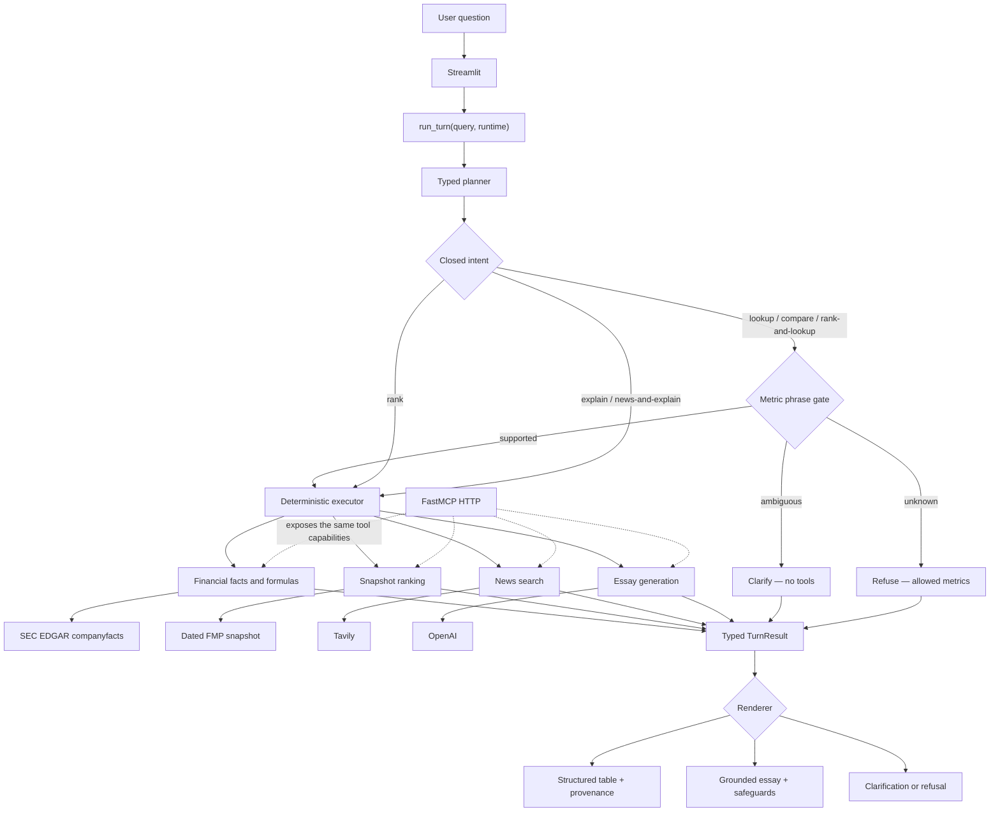

# Financial analyst agent — system design

## Executive summary

The financial analyst agent answers natural-language questions about quarterly financials,
company rankings, comparisons, and current events. It uses a language model to understand the
question, but it does not trust the model to select financial facts, perform arithmetic, choose
ranking members, or rewrite sourced numbers.

The design separates those responsibilities:

- A **typed planner** maps the question to one of six supported workflows.
- A **deterministic executor** decides which tools run and how their outputs are composed.
- **Provider adapters** retrieve SEC filings, a dated ranking snapshot, news, or model analysis.
- A **typed result** carries values, provenance, failures, and rendering instructions to the UI.

The central design principle is **constrained agency**: use the model where language
understanding helps, and deterministic code where correctness and auditability matter.

## Goals and scope

The system is designed to:

1. Retrieve directly reported quarterly facts with enough provenance to verify them in EDGAR.
2. Compare companies using aligned periods and deterministic formulas.
3. Rank operating companies from a reproducible market snapshot.
4. Compose ranking and fact lookup without asking the model to generate a constituent list.
5. Answer qualitative and current-event questions without presenting unsupported numbers.
6. Make routing, tool calls, data sources, and failures visible in one audience window.

This proof of concept is not a general-purpose research agent. It intentionally excludes open
tool loops, arbitrary financial metrics, PDF-first extraction, global market coverage,
authentication, durable conversation memory, and production deployment concerns.

## Architecture

### Request flow

1. **The user submits one question.** Streamlit sends it to
   `run_turn(query, runtime)`, the single application interface.
2. **The planner selects a closed intent.** It returns structured data rather than executable
   instructions. Supported intents are lookup, compare, rank, rank-and-lookup, explain, and
   news-and-explain.
3. **Structured financial questions pass through the metric phrase gate.** The metric is
   resolved from the original user question, not trusted from the planner. An ambiguous phrase
   asks the user to clarify; an unsupported phrase refuses before a data tool runs.
4. **The executor runs a fixed workflow.** Simple intents call one capability. Composed intents
   have explicit code paths: rank-and-lookup carries ranked CIKs into fact lookup, while
   news-and-explain passes search results into essay generation.
5. **Tools return typed data with provenance.** Financial facts include period, filing,
   accession, taxonomy, concept, and source URL. Rankings include snapshot time and source.
6. **`TurnResult` carries the complete outcome.** It contains the selected intent, ordered tool
   traces, table rows or essay text, banners, citations, and typed failure details.
7. **The renderer displays data without reinterpretation.** Financial answers become tables or
   fact cards built directly from tool fields. Essays are visibly labeled and checked before
   display.

## Component responsibilities

### Streamlit audience window

Streamlit is deliberately thin. It collects the question and displays:

- the selected intent;
- live or fixture runtime status;
- the answer;
- source and filing details; and
- expandable tool traces with inputs and provenance.

The UI does not contain business logic. It renders the presentation derived from `TurnResult`.

### Application orchestrator

`run_turn` owns the product behavior. It coordinates planning, input validation, execution, and
result construction. Streamlit, offline tests, and the fixture kill-switch all call this same
interface, which prevents separate demo and test implementations from drifting.

### Planner

The planner uses a structured model response to select an intent and extract entities such as
company names and industries. Its authority is deliberately limited:

- it cannot invent a new workflow;
- it cannot choose ranking constituents;
- it cannot select the final metric when the user's phrase is ambiguous; and
- it does not calculate or render financial values.

### Deterministic tools

The application exposes five capabilities:

- `get_financials` retrieves one directly reported quarterly fact;
- `compare_metrics` compares a reported metric or computes an approved formula;
- `rank_companies` ranks snapshot members by market capitalization;
- `search_news` retrieves current-event evidence; and
- `explain_topic` produces labeled qualitative analysis.

Company identity resolution lives inside the data tools. User-facing names and tickers resolve
to SEC CIKs, which remain the stable identity between ranking and filing lookup.

### Provider adapters

`Runtime` injects adapters for planning, financial facts, ranking, news, and essay generation.
Live mode uses SEC EDGAR, the packaged FMP snapshot, Tavily, and OpenAI. Fixture mode replaces
those adapters with recorded implementations while keeping the application and presentation
paths unchanged.

### FastMCP boundary

FastMCP exposes the same five capabilities over local HTTP. This makes the tool contract usable
by another MCP client without forcing the interview application to depend on an HTTP hop or
stdio child process. In-process execution keeps the demo reliable; MCP remains a real service
boundary rather than a second implementation.

## Key design decisions

### 1. Closed workflows instead of an open agent loop

**Decision:** one question maps to one of six intents, and code owns multi-tool composition.

**Why:** the important workflows are known, and mistakes can change financial meaning. A fixed
executor is easier to test, observe, and reason about than a model choosing arbitrary tool
sequences.

**Trade-off:** adding a new workflow requires code and tests. The system gives up some flexibility
in exchange for predictable behavior.

### 2. One application seam with injected adapters

**Decision:** UI, tests, and fixture mode call `run_turn(query, runtime)`.

**Why:** product behavior can be tested independently of Streamlit and external providers.
Adapters make network dependencies replaceable without changing orchestration.

**Trade-off:** `run_turn` is a high-value module that must stay cohesive as workflows grow. A
larger product would likely split intent executors behind the same public contract.

### 3. SEC XBRL is the source of quarterly facts

**Decision:** directly reported standalone-quarter facts come from SEC companyfacts, not a PDF
parser, vendor ratios, or model extraction.

**Why:** XBRL provides structured values, periods, units, forms, accessions, and concepts. The
selector can enforce an approximately 70–110 day 10-Q duration and preserve verifiable
provenance.

The selector does not derive a quarter by subtracting year-to-date values, does not manufacture
Q4, and does not silently choose between genuinely ambiguous candidates. If no supported
standalone fact exists, the system returns a typed failure.

**Trade-off:** issuer taxonomy variation still requires a reviewed concept catalog. PDF parsing
could later verify or supplement XBRL, but it should carry warnings rather than silently become
an equal source of truth.

See [ADR 0003](adr/0003-quarterly-fact-module.md).

### 4. Financial math is deterministic and period-aware

**Decision:** approved formulas are implemented as `Decimal` division of named components.

**Why:** the model should not perform arithmetic or decide whether two periods are comparable.
Formula components must have the same start and end dates, and zero denominators are handled
explicitly. `Decimal` avoids binary floating-point artifacts.

**Trade-off:** only cataloged formulas are available. Expanding the formula set requires explicit
component definitions and tests.

### 5. Ranking uses a dated membership snapshot

**Decision:** ranking reads a checked-in snapshot of US exchange-listed common shares of
operating companies.

**Why:** a fixed membership set makes results reproducible and prevents a live screener from
changing between requests or failing during the demonstration. ETFs, funds, SPACs, BDCs, notes,
preferreds, shells, and known residual non-operating issuers are excluded. Multiple share
classes collapse to one CIK.

The snapshot timestamp is part of the result. The system does not claim global or complete public
company coverage. Quarterly filing lookup remains independent of snapshot membership; only
snapshot-sourced metrics such as market capitalization require snapshot presence.

**Trade-off:** ranking is stable but not real-time. Production would schedule versioned snapshot
builds and define a freshness service-level objective.

See [ADR 0001](adr/0001-snapshot-membership.md) and
[ADR 0002](adr/0002-lookup-membership.md).

### 6. Ambiguity and unsupported scope are product states

**Decision:** ambiguous metric phrases clarify; unknown metrics and industries refuse.

**Why:** phrases such as “income,” “profit,” and “margin” can map to multiple valid financial
concepts. Guessing creates a plausible but semantically wrong answer. Clarification lists only
the matching supported names and calls no tools. Refusal shows the allowed catalog.

**Trade-off:** the user may need to rephrase a question that a less constrained assistant would
attempt. The extra interaction protects correctness.

See [ADR 0004](adr/0004-ambiguous-metric-clarify.md).

### 7. Structured numbers bypass generative rendering

**Decision:** lookup, compare, and ranking answers are rendered directly from typed tool output.

**Why:** a generated paragraph could round, omit, or rewrite a correct value. Typed rendering
keeps values and provenance together from provider to screen.

Qualitative essays are handled separately. General explanations are labeled as model analysis.
Current-event essays are generated only from returned news hits and show citations. A numeral
lock rejects numeric tokens that were not present in the tool input supplied to the essay.

**Trade-off:** structured answers are less conversational, and the numeral lock is intentionally
conservative. Both are acceptable costs for visible grounding.

### 8. Fixture mode replaces providers, not application logic

**Decision:** the kill-switch swaps the complete runtime for recorded adapters.

**Why:** the demonstration can survive network or provider failure while exercising the same
planner contract, executor, result model, and renderer. Gold tests use this path offline.

**Trade-off:** fixtures prove deterministic application behavior, not provider freshness. The UI
labels fixture mode prominently, and the presenter must state when recorded data is in use.

## Reliability and failure behavior

The system prefers an explicit partial result or refusal to an unsupported value.

- **Missing fact:** keep valid rows and mark the affected company with a typed reason.
- **Ambiguous XBRL candidate:** stop rather than select one silently.
- **Period mismatch:** do not compute a ratio or imply comparability.
- **Zero denominator:** return a typed non-compute result.
- **Unknown company, metric, or industry:** return a clear bounded failure.
- **No usable news:** refuse instead of falling back to model memory.
- **Provider error:** surface the failure; fixture mode is an explicit operational fallback.

Every successful structured result carries its source context. Financial facts retain filing and
concept provenance, while ranking and market-cap values retain snapshot provenance.

## Testing strategy

The default test suite is offline. Tests focus on externally visible behavior at `run_turn`:

- selected intent and tool order;
- returned values and periods;
- filing and snapshot provenance;
- clarification and refusal behavior;
- partial-result reasons;
- grounded essay citations and numeral-lock behavior; and
- identical presentation semantics in live and fixture runtimes.

Focused provider tests cover company resolution, SEC fact selection, snapshot filtering, and news
normalization. Gold tests replay the interview workflows through fixture mode. Separate
network-marked tests verify live OpenAI, SEC, and Tavily integrations without making CI depend on
external services.

## Current limits and production evolution

This design is a reliable proof of concept, not a complete production platform. The next
production steps would be:

1. Cache SEC responses by CIK and accession and add provider-specific retries, timeouts, and
   rate-limit handling.
2. Build versioned ranking snapshots on a schedule, with freshness monitoring and rollback.
3. Add routing and fact-selection evaluation sets based on real analyst questions.
4. Add authentication, authorization, audit logging, and tenant-aware data controls.
5. Introduce durable workflow state and human approval only for workflows that need it.
6. Add PDF verification with explicit disagreement handling.
7. Expand the metric catalog gradually, with ambiguity and provenance tests for every addition.

The architecture is intended to preserve the same trust boundary as it evolves: models interpret
language and synthesize supported evidence; deterministic components own financial facts,
identity, membership, arithmetic, and the final presentation of numbers.
