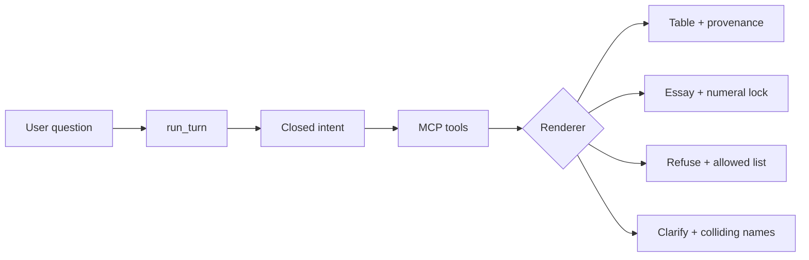

# Financial analyst agent — system design

A local Streamlit app answers one question at a time through a single interface, `run_turn(query, runtime)`. A typed planner picks a closed intent. Deterministic tools fetch SEC quarterly facts, rank from a dated universe snapshot, compare period-aligned metrics, search news, or write a labeled essay. Numbers come from filings and the snapshot, not from the model.

## Architecture

**User → intent → MCP tools → table vs essay.** Streamlit is the only audience window: query, intent chip, tool cards, answer. FastMCP HTTP exposes the same five tools the turn uses in-process. The graph does not depend on stdio subprocesses.

| Intent | Tools | Renderer |
| --- | --- | --- |
| `lookup` | `get_financials` | table |
| `compare` | `compare_metrics` | table |
| `rank` | `rank_companies` | table |
| `rank_and_lookup` | `rank_companies`, then `get_financials` or per-CIK `compare_metrics` on ranking CIKs | table |
| `explain` | `explain_topic` | essay + `model-analysis` banner |
| `news_and_explain` | `search_news`, then essay on those hits | essay + citations |

One user prompt maps to one intent. Composition is inside `rank_and_lookup` and `news_and_explain`, not by the model chaining tools. Identity (ticker/name → CIK) lives inside the tools so the planner cannot desync a resolve step.

## Reliability locks (ADRs)

These are the assumptions to defend in Q&A. Snapshot membership is recorded in [ADR 0001](adr/0001-snapshot-membership.md). Ambiguous metric phrases are [ADR 0004](adr/0004-ambiguous-metric-clarify.md).

1. **XBRL primary.** Latest-quarter facts come from SEC companyfacts, not a 10-Q PDF parse, FMP ratios, or edgartools. Standalone quarterly duration (about 70–110 days). No YTD subtraction, no derived Q4. Ambiguous concepts refuse rather than picking silently. Decimal, not float.

2. **No LLM math.** Catalog formulas (margins, R&D to sales, SG&A ratio, effective tax rate, interest coverage) are Decimal division of named components. Compare requires the same period start/end or the row is non-compute (`period_mismatch`). Partial rows keep the good company.

3. **Closed industry aliases.** Ranking membership is a dated freeze of US exchange-listed operating companies. `finance` / `healthcare` / `technology` map through a closed table. “AI” is not an industry — unknown strings refuse with the allowed names. ETFs, funds, preferreds, and residual non-operators (CIK blocklist) are out. Share classes collapse to one CIK (GOOG/GOOGL → Alphabet once).

4. **Tavily wrapper.** Named-company current events search the user query (`topic=news`, max 5, week). Hits missing title or URL are dropped. Empty hits refuse; there is no training-data fallback. Extract/map/crawl are not on the graph.

5. **Numeral lock.** Essay text may only contain numeric tokens that already appear in tool JSON. `explain` has no numeric tools, so invented dollars refuse. `news_and_explain` may use numbers from hit JSON. Structured answers are tables built from tool fields — a chatty paragraph cannot rewrite them.

6. **Snapshot ranking.** “Top 10 healthcare” reads the checked-in freeze, not a live screener. Membership does not change during a turn. Optional FMP cap refresh must not change who is in the set. The snapshot timestamp is visible on rank turns.

## Runtime

`run_turn` takes a runtime of adapters: fact lookup, snapshot ranking, news, structured completer, essay completer. Live adapters talk to SEC, the packaged freeze, Tavily, and OpenAI structured outputs (`gpt-5.6-terra`). Missing `OPENAI_API_KEY` is a configuration error, not a regex planner.

The fixture kill-switch swaps every adapter for recorded ones and still calls `run_turn`. Streamlit uses one renderer for both paths. If the kill-switch is on, say so out loud — do not present a cassette as live EDGAR.

Reported metrics: `revenue`, `cost_of_revenue`, `gross_profit`, `operating_expenses`, `operating_income`, `net_income`. Formulas: `gross_margin`, `operating_margin`, `net_margin`. Unique phrase or alias → proceed. Ambiguous metric → clarify pane (humanized candidates only, no tools). Unknown metric → refuse with the full list. The phrase is taken from the question, not from the planner’s slug.

## Demo script (25 minutes)

Walk this diagram, then the three live prompts, then one refuse:

1. *What was Google's net income based on their latest quarterly report?* — lookup, 10-Q fact, accession and source URL.
2. *What are the top 10 healthcare companies and the net income for each?* — rank-and-lookup; CIKs from ranking state; partial row if a fact is missing.
3. *Compare Microsoft and Google operating margins* — Decimal formula, period-aligned, one Alphabet row.
4. *What are the top 10 companies in AI?* — refuse with allowed industry names.

Backup: *How can AI disrupt healthcare?* (model-analysis essay). NVIDIA supply-chain only if Tavily was refreshed the same day.

How to run: see the README. Gold: `uv run pytest -m gold` (offline, fixture runtime).

## Production next steps (Q&A)

- PDF as a verify-against-XBRL fallback with warnings, not a second source of truth.
- Vendor TTM as a labeled column beside the 10-Q fact.
- Broader catalog review (balance sheet / instant ratios) once the gold set stays green. Grow the metric phrase table with that catalog; do not infer collisions from leftover stems.
- Banks/software aliases only if snapshot membership actually differs from the parent sector.
