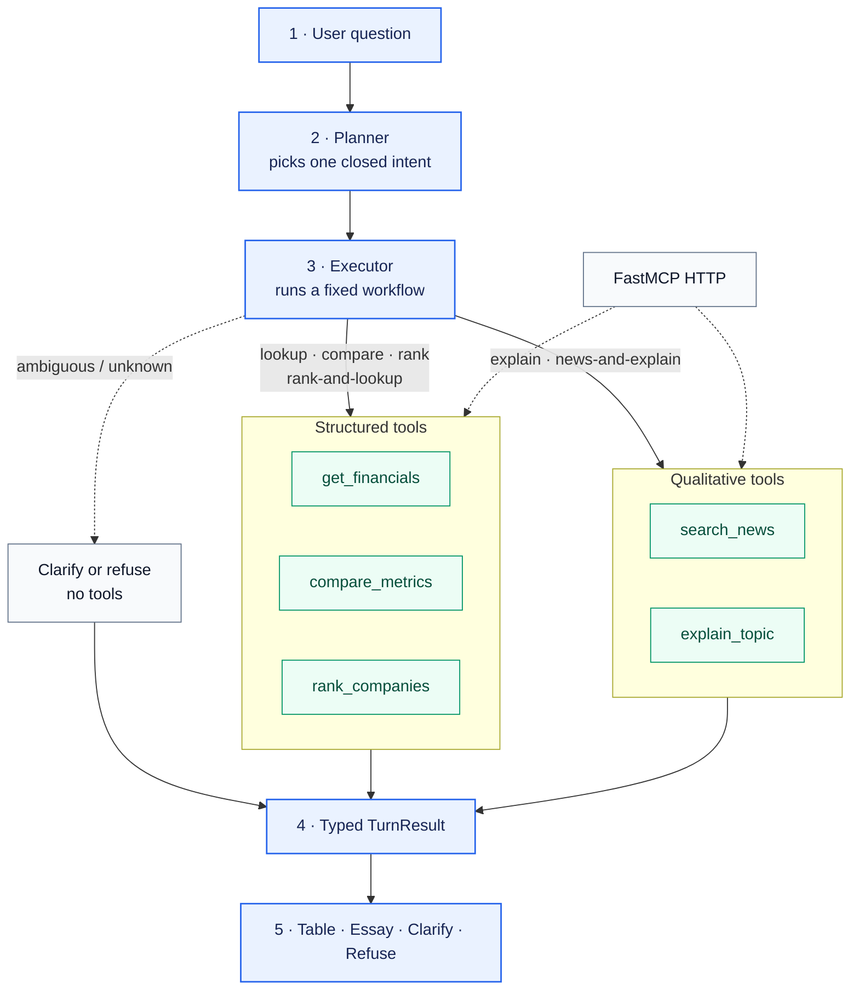

# Financial analyst agent

> **System design:** constrained model planning, deterministic financial tools, and
> provenance-first answers.

The agent answers questions about quarterly financials, company comparisons, market rankings,
and current events. A language model interprets the question, but deterministic code owns
financial facts, arithmetic, company identity, ranking membership, and the final display of
numbers.

## Architecture

### Request lifecycle

1. **Plan** — an OpenAI structured response selects one of six supported intents:
   lookup, compare, rank, rank-and-lookup, explain, or news-and-explain.
2. **Guard** — structured financial requests resolve the metric from the user's original
   wording. Ambiguous input asks for clarification; unsupported input refuses before data access.
3. **Execute** — code selects a fixed workflow. Multi-tool composition is explicit rather than
   chosen by an open-ended model loop.
4. **Collect evidence** — tools return typed values with filing, period, identity, snapshot, or
   citation provenance.
5. **Render** — a typed `TurnResult` becomes a table, grounded essay, clarification, or refusal.
   Financial values are never rewritten by the model.

## System boundaries

### Streamlit — audience layer

Collects a question and displays runtime status, intent, answer, provenance, and expandable tool
traces. It contains no financial business logic.

### `run_turn(query, runtime)` — application boundary

Coordinates planning, validation, execution, and result construction. Streamlit, tests, and
fixture mode all call this interface.

### Planner — language boundary

Selects a typed intent and extracts entities. It cannot invent workflows, choose ranked
constituents, calculate values, or resolve an ambiguous metric.

### Executor and tools — correctness boundary

Own company resolution, fact selection, ranking, comparisons, formulas, news retrieval, and
workflow composition. Company identity is carried as SEC CIK rather than model-generated ticker
text.

### Runtime adapters — provider boundary

Connect the application to SEC EDGAR, a packaged FMP snapshot, Tavily, and OpenAI. Recorded
adapters provide the same contracts in fixture mode.

### `TurnResult` — presentation boundary

Carries intent, ordered traces, values, provenance, citations, failures, and renderer choice.
This keeps provider output and presentation decoupled without losing audit information.

## Key design decisions

### 1. Constrained agency

**Decision:** use a closed intent set and deterministic executors instead of an open ReAct loop.

**Why:** the workflows are known and mistakes can change financial meaning. The model interprets
language; code controls tool order and data flow. For rank-and-lookup, ranked CIKs pass directly
into fact lookup—the model never generates the constituent list.

**Trade-off:** new workflows require code and tests, but existing behavior remains predictable
and inspectable.

### 2. One application interface, replaceable adapters

**Decision:** all entry points call `run_turn(query, runtime)`, with providers injected through
`Runtime`.

**Why:** application behavior can be tested independently of Streamlit and external services.
Live and recorded providers can change without creating separate execution paths.

**Trade-off:** `run_turn` is a critical module and must be kept cohesive as the product grows.

### 3. SEC XBRL as the quarterly source of truth

**Decision:** retrieve directly reported standalone-quarter facts from SEC companyfacts.

**Why:** XBRL includes values, units, periods, forms, accessions, taxonomies, and concepts. That
supports deterministic selection and a verifiable EDGAR link. The selector does not derive
quarters from year-to-date values or silently choose an ambiguous concept.

**Trade-off:** issuer taxonomy differences require a reviewed concept catalog. PDF parsing is a
future verification fallback, not an equal source of truth.

See [ADR 0003](adr/0003-quarterly-fact-module.md).

### 4. Deterministic math and reproducible ranking

**Decision:** formulas use `Decimal` and period-aligned components; rankings use a dated
membership snapshot.

**Why:** the model should not calculate ratios or decide whether periods are comparable. A dated
snapshot also keeps market membership stable during a demo and across tests. Non-operating
listings are excluded, and multiple share classes collapse to one CIK.

**Trade-off:** formulas are limited to the reviewed catalog, and ranking is reproducible rather
than real-time. The snapshot timestamp is always part of the result.

See [ADR 0001](adr/0001-snapshot-membership.md) and
[ADR 0002](adr/0002-lookup-membership.md).

### 5. Provenance-first output and explicit failure

**Decision:** structured answers render directly from typed tool output. Ambiguity, missing data,
and unsupported scope remain visible product states.

**Why:** generated prose could round or rewrite a correct number. Tables preserve values and
their filing or snapshot provenance. Partial results keep valid rows while marking failures.
Ambiguous metric phrases clarify without running tools; unknown metrics and industries refuse.

Qualitative essays are separated from financial tables. Current-event essays use returned news
hits and citations; a numeral lock rejects numeric tokens absent from the supplied evidence.

**Trade-off:** responses are more conservative and sometimes require the user to rephrase.

See [ADR 0004](adr/0004-ambiguous-metric-clarify.md).

### 6. Real MCP boundary without a fragile demo dependency

**Decision:** FastMCP exposes the five tool capabilities over HTTP, while the app may call the
same contracts in-process.

**Why:** MCP is a genuine integration boundary, but the interview path does not depend on a
stdio child process or unnecessary network hop. The five capabilities are financial lookup,
comparison, ranking, news search, and qualitative explanation.

**Trade-off:** the POC does not demonstrate distributed deployment. The contracts are ready for
it without imposing that operational cost on the demo.

## Reliability model

The system prefers an explicit failure to a plausible but unsupported answer:

- missing facts produce partial rows rather than fabricated values;
- ambiguous XBRL candidates stop instead of being selected silently;
- mismatched periods and zero denominators do not compute;
- unknown companies, metrics, or industries return bounded errors;
- empty news results refuse instead of falling back to model memory; and
- provider failures can be demonstrated through a clearly labeled fixture runtime.

Fixture mode replaces providers—not orchestration or presentation. It proves deterministic
application behavior, not live data freshness, and must be disclosed when used.

## Verification and production path

The default test suite is offline and asserts behavior at `run_turn`: intent, tool order, values,
periods, provenance, partial failures, citations, and renderer choice. Gold tests replay the demo
workflows through fixture mode. Separate network-marked tests cover live OpenAI, SEC, and Tavily
integrations.

Production evolution would add:

1. provider caching, retries, rate limits, and observability;
2. scheduled, versioned snapshots with freshness monitoring;
3. routing and fact-selection evaluation sets;
4. authentication, authorization, and audit logging;
5. durable workflow state where human approval is valuable; and
6. PDF verification with explicit disagreement handling.

The trust boundary should remain unchanged as the system grows: **models interpret language and
synthesize supplied evidence; deterministic components own financial truth.**
